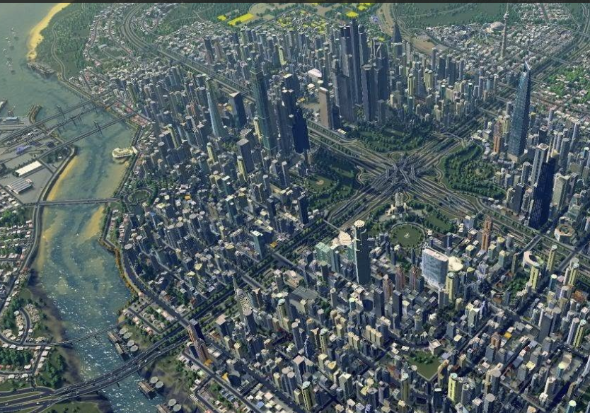

# zyua0849_FinalAssignment
## Interactive Description

Using Perlin noise, the colors of the small squares on the yellow lines change randomly over time. Meanwhile, the randomly generated rectangles move either horizontally or vertically based on their aspect ratio.

## Inspiration and iteration

Inspired by the game Cities: Skylines, our image resembles a grid, looking like an abstract version of a city. Therefore, I wanted to introduce some movement. Initially, the idea was to move the small squares on the yellow lines horizontally, but the result wasn't aesthetically pleasing.

Through experimentation, we settled on the current effect: making large rectangles move to mimic vehicles on city roads and making the small squares change colors like stars in the sky or the ever-changing city buildings.

## Changes Made to Group Code

**Removed noLoop:** 
The original code used the noLoop method, which prevented animation effects in the draw function. To enable animation, I removed noLoop.

**Separated Calculation and Generation:** 
The original code combined calculations and generation in a single function, and it generated patterns randomly. In the draw function, this would lead to infinite generation, covering the entire canvas. To resolve this, I split the function into two separate functions: one for calculation, placed in setup to run only once, and one for generation, placed in draw to include animation effects.

**Introduced Class for Rectangle:**
The original code did not use classes. In my code, I converted the rectangle into a class, making the code more concise.